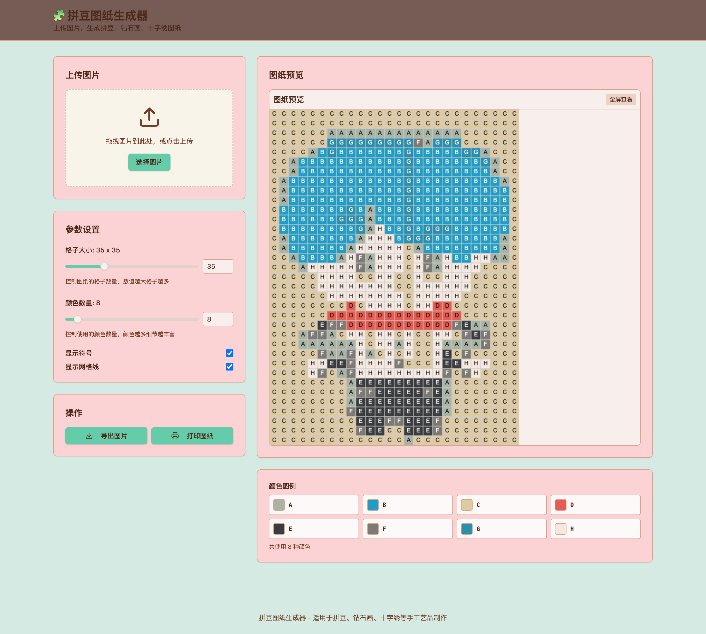
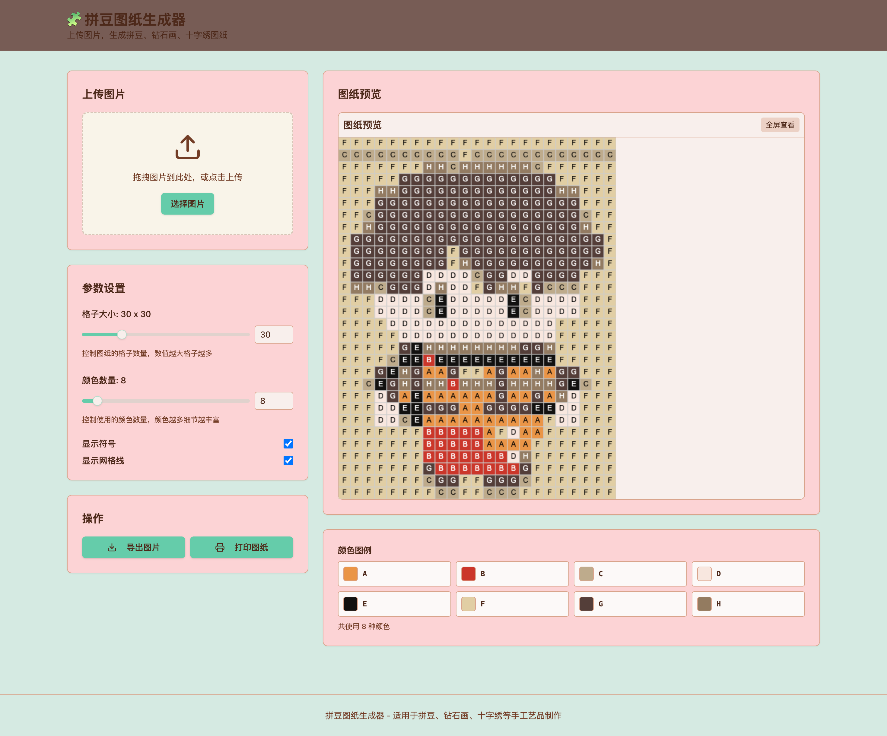

# 1pic2bean 拼豆图纸生成器

[](https://opensource.org/licenses/MIT)

一个将任意图片转换为拼豆、钻石画、十字绣图纸的在线工具。通过调节参数，您可以自定义生成的图纸效果。

## 功能特点

- 📤 **图片上传**：支持拖拽上传或点击上传任意图片
- 🎨 **参数调节**：可自定义格子大小和颜色数量
- 🧩 **智能处理**：自动进行颜色量化和符号映射
- 🖨️ **多种导出**：支持导出为PNG图片或直接打印
- 📱 **响应式设计**：适配不同屏幕尺寸，支持移动端使用
- 🖥️ **全屏预览**：支持全屏查看生成的图纸效果

## 使用方法

1. **上传图片**：将您想要转换的图片拖拽到上传区域，或点击"选择图片"上传
2. **调节参数**：
   - 格子大小：控制图纸的格子数量，数值越大格子越多
   - 颜色数量：控制使用的颜色数量，颜色越多细节越丰富
   - 显示符号：开启后会在格子中显示对应的颜色符号
   - 显示网格线：开启后会显示格子的边框线
3. **预览效果**：实时查看生成的拼豆图纸效果
4. **导出图纸**：点击"导出图片"将图纸保存为PNG文件，或点击"打印图纸"直接打印

## 项目截图

### 上传图片



### 生成效果示例


## 技术实现

本项目基于React + TypeScript + Vite构建，使用了以下关键技术：

- **Canvas API**：用于图像处理和绘制
- **K-Means算法**：实现智能颜色量化
- **Tailwind CSS**：提供现代化的UI样式
- **Shadcn/ui**：提供高质量的React组件

## 项目结构

```
src/
├── components/          # React组件
│   ├── ImageControls.tsx # 图片上传和参数控制组件
│   └── PixelGrid.tsx     # 像素网格绘制组件
├── utils/               # 工具函数
│   └── imageProcessing.ts # 图像处理相关函数
└── App.tsx             # 主应用组件
```

## 开发环境搭建

1. 克隆项目到本地：
   ```bash
   git clone https://github.com/kiyoumiii/pixel-bead-generator.git
   cd pixel-bead-generator
   ```

2. 安装依赖：
   ```bash
   npm install
   ```

3. 启动开发服务器：
   ```bash
   npm run dev
   ```

4. 在浏览器中打开 http://localhost:5173 查看项目

## 参数说明

### 格子大小
- 范围：10-100
- 默认值：30
- 影响：控制生成图纸的格子数量，数值越大生成的图纸越精细

### 颜色数量
- 范围：4-64
- 默认值：16
- 影响：控制使用的颜色数量，颜色越多细节越丰富，但也会增加制作难度

### 显示符号
- 开启：在每个格子中显示对应的颜色符号
- 关闭：仅显示颜色，不显示符号

### 显示网格线
- 开启：显示格子的边框线
- 关闭：不显示边框线，更接近实际的拼豆效果

## 适用场景

- **拼豆制作**：将照片转换为拼豆图纸
- **钻石画制作**：生成钻石画的参考图案
- **十字绣制作**：制作十字绣的底图
- **手工制作**：为各种手工艺品提供设计参考

## 浏览器兼容性

- Chrome 60+
- Firefox 55+
- Safari 12+
- Edge 79+

## 许可证

本项目采用MIT许可证，详情请见 [LICENSE](LICENSE) 文件。

## 贡献

欢迎提交Issue和Pull Request来改进这个项目！